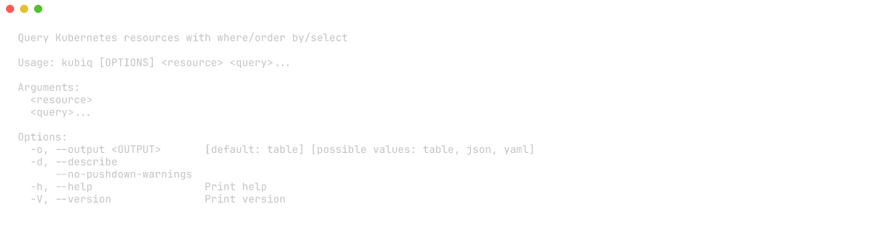
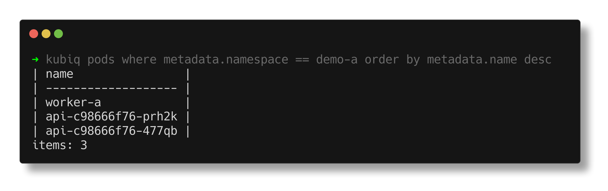
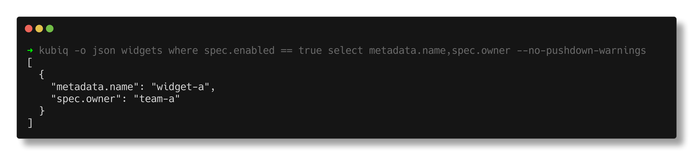
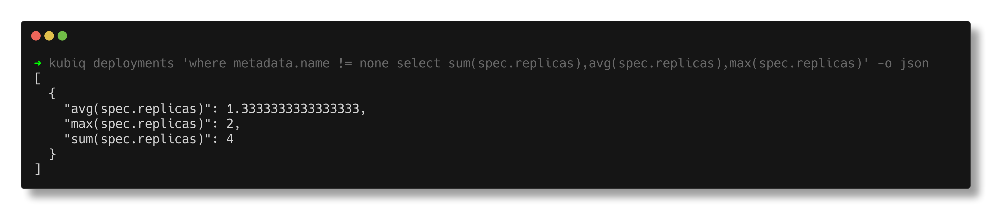

<p align="center">
  
</p>

<p align="center">
  SQL-like queries for any Kubernetes resource.
</p>

# Kubiq

Kubiq is a lightweight CLI to run SQL-like queries against the Kubernetes API.
It works with both core resources and CRDs through a single query interface.

## Current Status

Current release baseline: `v0.3.0`.

## Features

- Query any plural Kubernetes resource (`pods`, `deployments`, `widgets`, ...)
- `where` filtering with `==`, `!=`, and `AND`
- `select` projection for specific fields
- Global aggregations in `select`: `count`, `sum`, `min`, `max`, `avg`
- `order by` with multi-key sorting and `asc|desc`
- Best-effort server-side filter pushdown for supported predicates
- Output formats: `table`, `json`, `yaml`
- Summary mode by default and full object output with `--describe`

## Quick Start

### Prerequisites

- Rust stable
- `kubectl`
- Access to a Kubernetes cluster

### Install

```bash
cargo install --git https://github.com/1ort/kubiq kubiq
```

### Build from source

```bash
cargo build --release
```

### Run

```bash
cargo run -- <query args>
```

## Usage

```bash
kubiq [--output table|json|yaml] [--describe] <resource> where <predicates> [order by <keys>] [select <paths>|<aggregations>]
```

Options:

- `-o, --output <format>`: `table` (default), `json`, `yaml`
- `-d, --describe`: print full nested object
- `--no-pushdown-warnings`: suppress pushdown/fallback warnings in stderr
- `-h, --help`: show help
- `-V, --version`: show version

## CLI Preview



## Query Screenshots





## Examples

```bash
# Basic filter
kubiq pods where metadata.namespace == demo-a

# Filter + projection
kubiq pods where metadata.namespace == demo-a select metadata.name,metadata.namespace

# Filter + sorting
kubiq pods where metadata.namespace == demo-a order by metadata.name desc

# Full nested output
kubiq -o yaml -d pods where metadata.name == worker-a

# CRD example
kubiq -o json widgets where spec.enabled == true select metadata.name,spec.owner

# Aggregation examples
kubiq -o json pods where metadata.namespace == demo-a select count(*)
kubiq -o json pods where metadata.namespace == demo-a select sum(metadata.generation),avg(metadata.generation)
```

## Documentation

- [Documentation Overview](docs/overview.md)
- [CLI Specification](docs/product/cli_spec.md)
- [Query Language Semantics](docs/query_language/semantics.md)
- [Setup (contributors)](docs/development/setup.md)
- [Development Workflow (contributors)](docs/development/workflow.md)

## Contributing

Contributor workflow, testing, and automation details are documented in `docs/development/*`.
